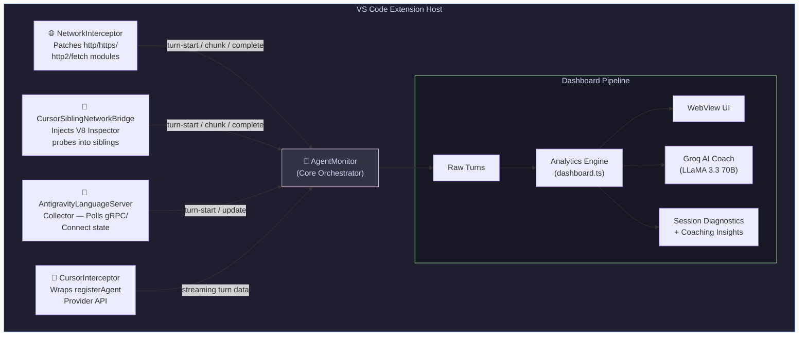
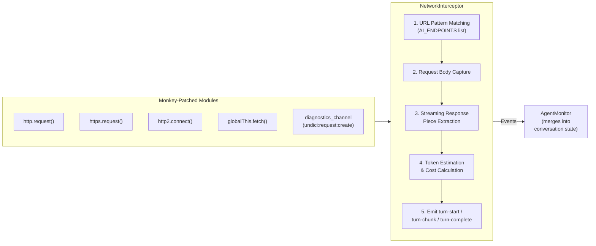
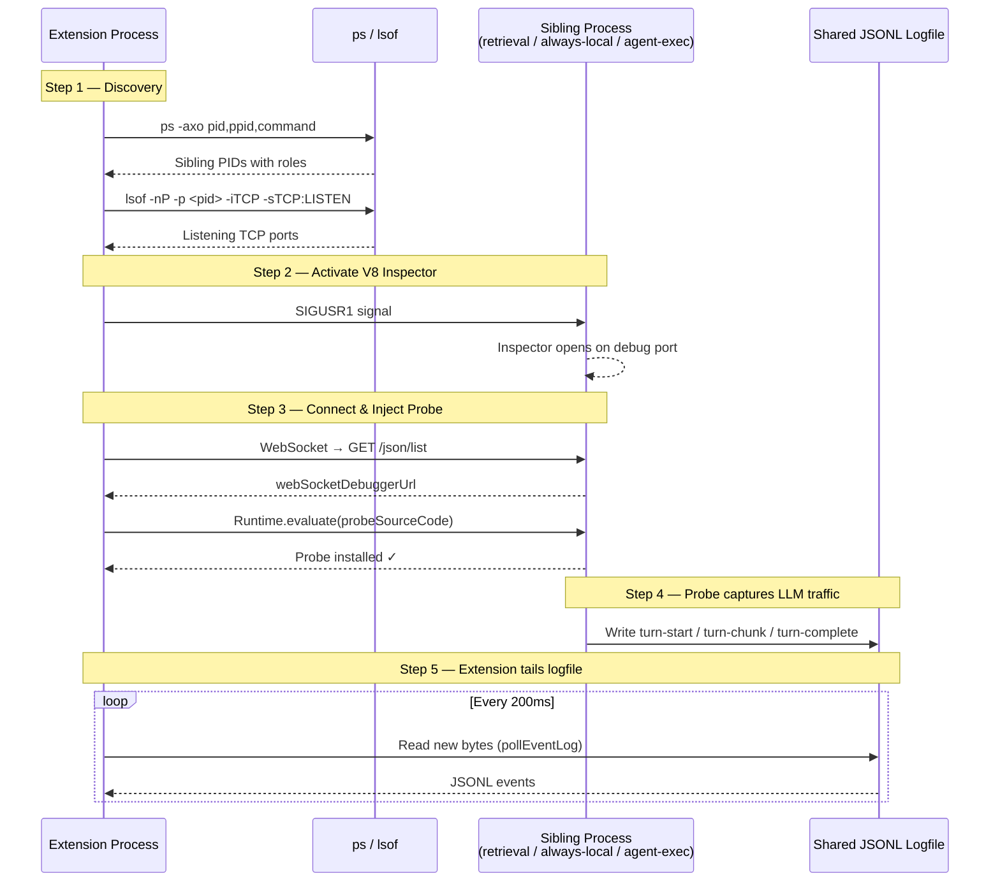
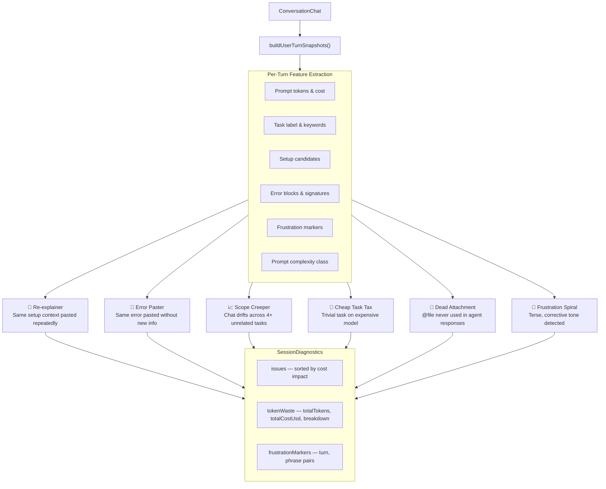
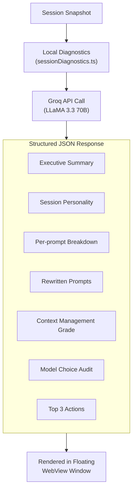
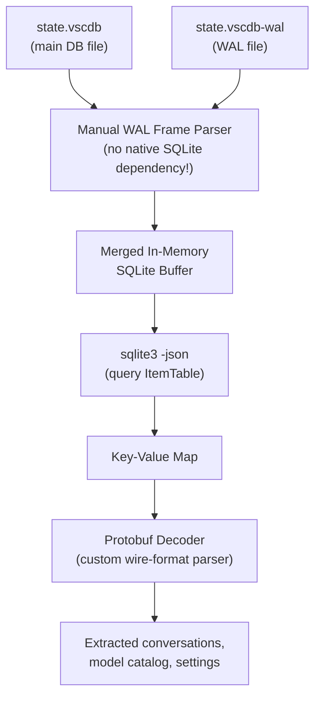

<div align="center">

# 🔬 AI Agent Monitor

### Universal Token Analytics & AI Coaching for AI-Powered Coding Sessions

[](https://code.visualstudio.com/)
[](https://www.typescriptlang.org/)
[](./ai-agent-monitor/LICENSE)
[](https://groq.com/)

**Stop flying blind with AI agents.** Know exactly how many tokens you're burning, how much it costs, and what you can do better — all in real time, right inside VS Code.

[Features](#-features) · [Architecture](#-architecture) · [How It Works](#-how-it-works) · [Installation](#-installation) · [Configuration](#%EF%B8%8F-configuration)

</div>

---

## 📖 What Is This?

**AI Agent Monitor** is a VS Code extension that acts as a **flight recorder for your AI coding sessions**. Whether you're using **Cursor** or **Antigravity (Gemini Code Assist)**, this extension passively observes every interaction between you and the AI agent, then gives you:

- 📊 **Real-time token & cost tracking** — see exactly what each prompt costs
- 🧠 **AI Coaching** — LLM-powered analysis of your prompting patterns (via Groq)
- 🔍 **Session Diagnostics** — detects anti-patterns like "The Re-explainer" or "The Error Paster"
- 📈 **Trend Analytics** — daily/weekly/monthly spend breakdowns
- 💡 **Model Recommendations** — tells you when you're overpaying for a simple task

> **Think of it as a fitness tracker, but for your AI token spending.**

---

## ✨ Features

| Feature | Description |
|---|---|
| **Live Dashboard** | Real-time WebView panel showing active session metrics, cost, and context usage |
| **Network Interception** | Passively captures all LLM API traffic by patching Node.js internals — zero config required |
| **Cursor Deep Integration** | Injects probes into Cursor's sibling processes via V8 Inspector Protocol |
| **Antigravity Support** | Polls the Antigravity Language Server via gRPC/Connect for state updates |
| **AI Coach (Groq)** | Sends session data to Groq (LLaMA 3.3 70B) for actionable coaching insights |
| **Session Diagnostics** | Detects 6 failure patterns: Re-explainer, Error Paster, Scope Creeper, Cheap Task Tax, Dead Attachment, Frustration Spiral |
| **Full Session Analysis** | One-click deep report with prompt-by-prompt breakdown, rewritten prompts, and a "session personality" |
| **Context Health Score** | Tracks `@file` references, identifies dead attachments wasting tokens every turn |
| **Model Recommendation Engine** | Classifies prompt complexity and suggests cheaper models when appropriate |
| **Budget Alerts** | Configurable daily/monthly cost and token thresholds with real-time warnings |
| **Prompt Library** | Saves high-performing prompts for reuse across sessions |
| **Cross-Session Patterns** | Aggregates behavior trends across your last 30 days of sessions |
| **SQLite State Extraction** | Reads Cursor/Antigravity's internal `state.vscdb` databases with WAL merge support |

---

## 🏗 Architecture

### High-Level System Overview



### Source File Map

```
ai-agent-monitor/
├── src/
│   ├── extension.ts                        # Entry point — registers commands, activates monitors
│   ├── AgentMonitor.ts                     # 🧠 Central orchestrator (1,599 lines)
│   ├── NetworkInterceptor.ts               # 🌐 Patches Node.js networking stack
│   ├── CursorSiblingNetworkBridge.ts       # 🔌 V8 Inspector probe injection into Cursor siblings
│   ├── cursorRemoteProbe.ts                # 📡 The probe code injected into sibling processes (5,120 lines)
│   ├── CursorInterceptor.ts                # 🎯 Wraps Cursor's registerAgentProvider API
│   ├── CursorContextAnalyzer.ts            # 📎 Tracks @file references and dead attachments
│   ├── AntigravityLanguageServerCollector.ts # 🔗 gRPC/Connect polling for Antigravity state
│   ├── dashboard.ts                        # 📊 Analytics computation, cost estimation, model profiles
│   ├── sessionDiagnostics.ts               # 🩺 6 anti-pattern detectors (861 lines)
│   ├── groqClient.ts                       # 🤖 Groq API integration for AI coaching (1,288 lines)
│   ├── stateSqlite.ts                      # 💾 SQLite + WAL reader with Protobuf decoder
│   ├── webviewContent.ts                   # 🎨 Dashboard HTML/CSS/JS generation
│   ├── sidebarProvider.ts                  # 📋 VS Code sidebar tree view
│   └── types.ts                            # 📐 All TypeScript interfaces (434 lines)
├── package.json                            # Extension manifest, commands, configuration schema
├── esbuild.js                              # Build configuration
├── tsconfig.json
└── README.md
```

---

## 🔄 How It Works

### 1. Network Interception — Capturing LLM Traffic

The most technically interesting part of this project. The `NetworkInterceptor` **monkey-patches Node.js core modules** to passively observe all outgoing HTTP/HTTPS/HTTP2 traffic. It identifies LLM API calls by matching URL patterns (OpenAI, Anthropic, Google, etc.) and extracts token counts, model names, and costs.



**Key design choice:** The interceptor uses a **debounced emit system** (`NetworkEmitHandle`) to batch rapid streaming chunks into a single dashboard update, preventing UI thrashing during high-velocity SSE responses.

**What gets patched:**
- `http.request()` / `https.request()` / `http.get()` / `https.get()`
- `http2.connect()` → wraps the returned session's `.request()` method
- `globalThis.fetch()` — fallback when `diagnostics_channel` isn't available
- `diagnostics_channel` subscription for `undici:request:create` events

### 2. Cursor Sibling Network Bridge — Cross-Process Interception

Cursor runs multiple Node.js processes (retrieval, always-local, agent-exec). Since the extension only lives in one process, it needs to **reach into sibling processes** to capture their LLM traffic.



The injected probe (`cursorRemoteProbe.ts` — 5,120 lines) is a complete network interception engine that runs **inside the sibling process**. It patches the same Node.js modules and additionally hooks into Cursor's internal Connect/gRPC transport layer.

### 3. Session Diagnostics — Anti-Pattern Detection

The diagnostics engine analyzes your conversation in real-time and flags 6 failure patterns:



Each detector produces a `SessionFailureInsight` with:
- **Severity level** (`info`, `warn`, `danger`)
- **Estimated token waste** and dollar cost
- **Actionable recommendation** (e.g., "Start a fresh chat with a 120-word project brief")
- **Evidence** (specific turn excerpts that triggered the pattern)

### 4. AI Coaching via Groq

When you have a Groq API key configured, the extension sends structured session data to **LLaMA 3.3 70B** for deeper analysis:



For large sessions, the payload is **chunked** (target ~42K chars per chunk) and merged across multiple API calls to stay within Groq's context window.

### 5. SQLite State Extraction

Both Cursor and Antigravity store conversation state in SQLite databases (`state.vscdb`). The extension reads these directly — including **uncommitted WAL (Write-Ahead Log) data**:



**Why not just use `better-sqlite3`?** Because VS Code extensions run in a sandboxed environment where native Node modules are problematic. Instead, this project implements a **pure-TypeScript SQLite page reader** that understands the SQLite B-tree page format and WAL frame structure, plus a **custom Protobuf decoder** for Cursor's binary conversation storage.

---

## 📦 Installation

### Prerequisites

- [VS Code](https://code.visualstudio.com/) ≥ 1.85.0 (or Cursor / Antigravity)
- [Node.js](https://nodejs.org/) ≥ 18.x
- (Optional) [Groq API Key](https://console.groq.com/) for AI coaching features

### Build & Install

```bash
# Clone the repository
git clone https://github.com/amEya911/llmetrics.git
cd llmetrics/ai-agent-monitor

# Install dependencies
npm install

# Build, package, and install the extension
npm run install:local
```

This will:
1. Compile TypeScript via esbuild
2. Package as a `.vsix` file
3. Install into your VS Code / Cursor instance

### Quick Verify

After installation, open the Command Palette (`Cmd+Shift+P`) and run:

```
AI Agent Monitor: Open Dashboard
```

You should see the analytics dashboard open in a new editor tab.

---

## ⚙️ Configuration

All settings are under `aiAgentMonitor.*` in VS Code settings:

| Setting | Type | Default | Description |
|---|---|---|---|
| `aiAgentMonitor.groqApiKey` | `string` | `""` | Your Groq API key for AI coaching |
| `aiAgentMonitor.dailyCostBudgetUsd` | `number` | `null` | Daily cost budget in USD |
| `aiAgentMonitor.monthlyCostBudgetUsd` | `number` | `null` | Monthly cost budget in USD |
| `aiAgentMonitor.dailyTokenBudget` | `number` | `null` | Daily token budget |
| `aiAgentMonitor.monthlyTokenBudget` | `number` | `null` | Monthly token budget |

### Setting Up Groq (Optional but Recommended)

1. Get a free API key at [console.groq.com](https://console.groq.com/)
2. Open VS Code Settings → search for `aiAgentMonitor.groqApiKey`
3. Paste your key

This unlocks:
- Real-time AI coaching insights
- Full session analysis reports
- Pattern-aware prompt recommendations

---

## 🎯 Commands

| Command | Shortcut | Description |
|---|---|---|
| `AI Agent Monitor: Open Dashboard` | `Cmd+Shift+M` | Opens the main analytics WebView |
| `AI Agent Monitor: Run Full Session Analysis` | — | Generates a deep LLM-powered report for the active session |
| `AI Agent Monitor: Save Prompt to Library` | — | Saves the current prompt to your reusable prompt library |
| `AI Agent Monitor: Clear History` | — | Resets all tracked session data |

---

## 🧪 Technical Deep Dives

### How Network Interception Actually Works

The `NetworkInterceptor` replaces functions on the `http`, `https`, and `http2` modules at the prototype level. Here's the simplified flow:

```typescript
// Simplified — actual code is in NetworkInterceptor.ts
const originalRequest = https.request;

https.request = function patchedRequest(url, options, callback) {
  const req = originalRequest.call(this, url, options, callback);

  if (isLlmApiUrl(url)) {
    // Capture request body (the prompt)
    interceptRequestBody(req);

    // Capture response body (the completion)
    req.on('response', (res) => {
      interceptResponseBody(res, (body) => {
        const tokens = extractTokenUsage(body);
        emit('turn-complete', { url, tokens, model, cost });
      });
    });
  }

  return req; // Original request proceeds unchanged
};
```

**Critical safety measures:**
- All patches are wrapped in `try/catch` — a monitoring failure never crashes the host
- The interceptor sets a special header (`X-AI-Token-Analytics-Ignore`) on its own Groq API calls to avoid infinite loops
- Debounced event emission prevents UI updates faster than every 120ms during streaming

### How Cursor Sibling Injection Works

```typescript
// 1. Find sibling processes via lsof
const siblings = await execFile('lsof', ['-p', cursorPid]);
// Parse for Node.js processes with roles: retrieval, always-local, agent-exec

// 2. Activate V8 Inspector in the target process
process.kill(siblingPid, 'SIGUSR1'); // Opens inspector on a random port

// 3. Connect via WebSocket and evaluate the probe code
const ws = new WebSocket(inspectorUrl);
ws.send(JSON.stringify({
  method: 'Runtime.evaluate',
  params: { expression: probeSourceCode }
}));

// 4. The probe now captures all LLM traffic inside the sibling process
// and writes events to a shared JSON-lines logfile

// 5. Extension tails the logfile via fs.watch()
```

### Model Pricing Engine

The dashboard includes a built-in model pricing database covering:

| Model Family | Input $/1K tokens | Output $/1K tokens |
|---|---|---|
| Claude Opus | $0.015 | $0.075 |
| Claude Sonnet | $0.003 | $0.015 |
| GPT-5 / Codex | $0.003 | $0.012 |
| GPT-4o / GPT-4.1 | $0.0025 | $0.010 |
| Gemini 2.5 Pro | $0.00125 | $0.010 |
| Gemini 2.5 Flash | $0.0003 | $0.0025 |
| Cursor Auto | $0.003 | $0.015 |

The **Model Recommendation Engine** cross-references prompt complexity classification against the current model to flag overspend:

```
Prompt: "rename this variable from x to count"
Complexity: trivial
Current Model: Claude Sonnet (Tier 1)
Recommended: Gemini Flash or Claude Haiku (Tier 0)
Estimated Overspend: $0.004 per turn
```

---

## 📊 Dashboard Sections

The WebView dashboard is a premium dark-themed analytics interface with these sections:

1. **Live Session** — Current active chat with token count, cost, model, and context usage bar
2. **Groq AI Coach** — Most urgent insight from the coaching engine, with severity badge
3. **Per-Message Timeline** — Prompt-by-prompt cost flow for the active session
4. **Spend Summary** — Today / This Week / This Month aggregated metrics
5. **Daily Spend Trend** — Bar chart showing cost trajectory over time
6. **Model Efficiency Score** — Per-model breakdown with usage meters
7. **Agent Mix Breakdown** — Which agents (Cursor, Antigravity) are consuming what
8. **Your Patterns** — Cross-session behavioral patterns and trends
9. **Budget Settings** — Configure daily/monthly cost and token thresholds
10. **Prompt Library** — Saved high-performing prompts with search

---

## 🛡️ Design Principles

| Principle | Implementation |
|---|---|
| **Passive observation** | Never modifies, delays, or interferes with agent requests |
| **Crash isolation** | Every interception point is wrapped in `try/catch` with safe fallbacks |
| **No native dependencies** | Custom SQLite/WAL/Protobuf parsers — pure TypeScript, no `node-gyp` |
| **Performance** | Debounced emitters, LRU caches, lazy evaluation of analytics |
| **Privacy** | All data stays local; Groq calls are opt-in and use only session metadata |

---

## 🤝 Contributing

1. Fork the repository
2. Create a feature branch: `git checkout -b feature/my-feature`
3. Make your changes in `ai-agent-monitor/src/`
4. Build and test: `npm run build && npm run lint`
5. Submit a Pull Request

### Development Workflow

```bash
cd ai-agent-monitor

# Watch mode — rebuilds on file changes
npm run watch

# In VS Code, press F5 to launch Extension Development Host
# The extension will auto-reload on rebuild
```

---

## 📄 License

This project is licensed under the **MIT License** — see [LICENSE](./ai-agent-monitor/LICENSE) for details.

---

<div align="center">

**Built by [Ameya Kulkarni](https://github.com/amEya911)**

*Because if you're going to spend tokens, you should at least know where they're going.*

</div>

